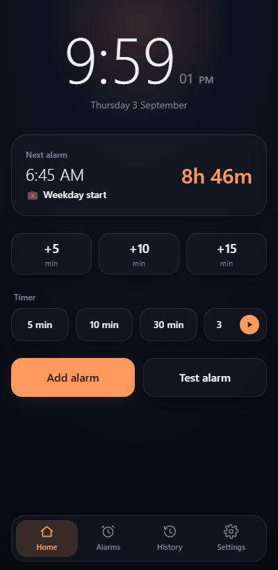
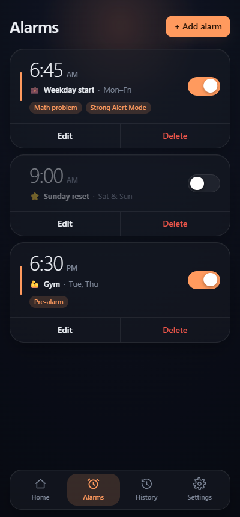
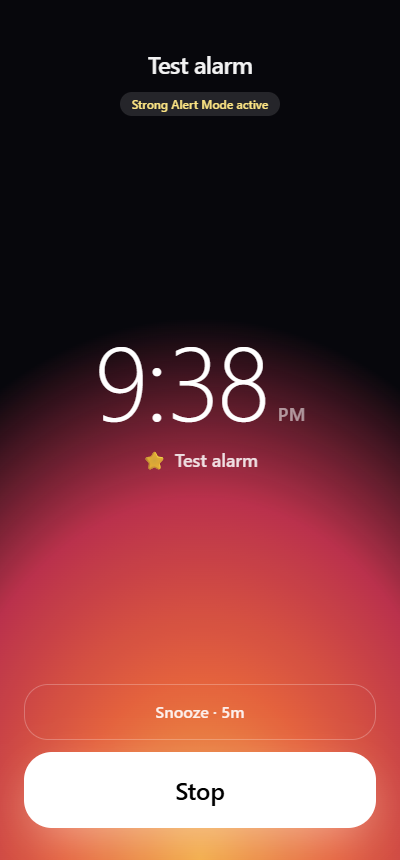
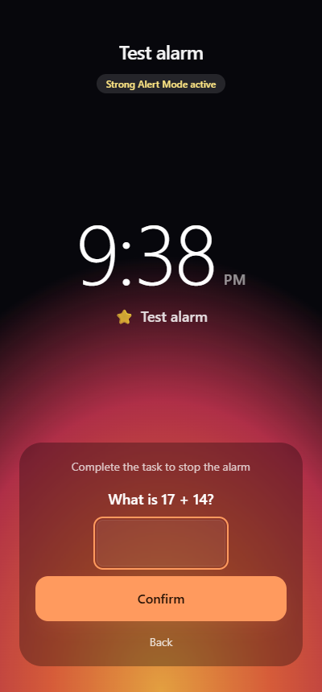
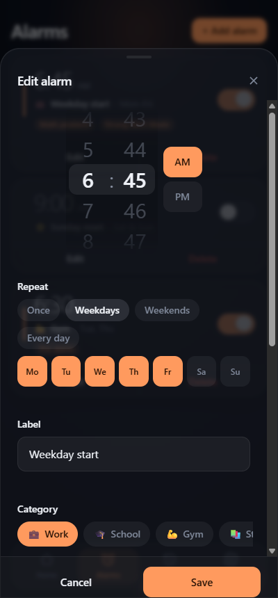
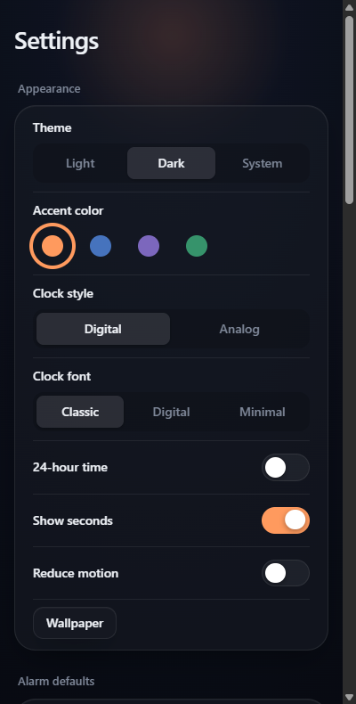
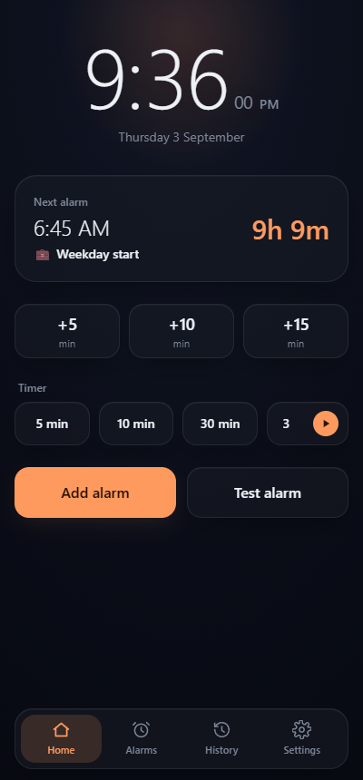

# Smart Alarm

[](https://github.com/Sayed5563/smart-alarm/actions/workflows/ci.yml)
[](https://github.com/Sayed5563/smart-alarm/actions/workflows/deploy.yml)


An offline‑first, installable **Progressive Web App** alarm clock with "smart
wake‑up" features designed to make it genuinely hard to fall back asleep.

<p align="center">
  <a href="https://sayed5563.github.io/smart-alarm/">
    
  </a>
</p>

<p align="center"><b>Live demo → <a href="https://sayed5563.github.io/smart-alarm/">sayed5563.github.io/smart-alarm</a></b> — installable, works offline (use “Add to Home Screen”).</p>

No account. No server. No tracking. Everything lives in your browser.

## Screenshots

<table>
  <tr>
    <td width="33%"></td>
    <td width="33%"></td>
    <td width="33%"></td>
  </tr>
  <tr>
    <td width="33%"></td>
    <td width="33%"></td>
    <td width="33%"></td>
  </tr>
</table>

---

## What it does

- **Clock** — digital (12h / 24h, optional seconds, three fonts) or a clean
  responsive analog face with a screen‑reader text equivalent.
- **Multiple independent alarms** — each with its own label, category, repeat
  rule, sound, volume, fade‑in, snooze, vibration, importance and smart options.
- **Repeat rules** — once, every day, weekdays, weekends, or any custom set of
  days. The scheduler correctly handles "today already passed", week wrap‑around
  and the 23:59 → 00:00 boundary.
- **Sound library** — nine built‑in tones that are **synthesized with the Web
  Audio API** (no audio files, no network). Upload your own MP3/WAV/OGG/M4A,
  preview it, assign it per alarm, delete it. Custom audio is stored in
  IndexedDB on your device only.
- **Per‑alarm volume** and a smooth **fade‑in** (10s / 30s / 60s / 5min) that
  ramps the app's own gain — it never touches the device volume.
- **Pre‑alarm** — an optional softer sound a few minutes before the real alarm,
  clearly labelled so it is never confused with the main alarm.
- **Snooze** — configurable per alarm (5/10/15/20/custom). Snoozing creates a
  transient one‑off ring and **never modifies the recurring schedule**. Snooze
  counts are recorded for statistics.
- **After‑stop sound** — an optional second sound that begins once you stop the
  alarm. Choose **"can be stopped"** or **"must play to the end"**.
- **Wake‑up tasks** (anti‑sleep) — require a task before *Stop* works:
  - **Math** — randomised arithmetic, easy / medium / hard, 1–5 rounds.
  - **Type a code** — a 4–6 digit code you must re‑enter.
  - **Button sequence** — reproduce a shuffled order.
  - **Scan a QR code** — uses the device camera via the native `BarcodeDetector`
    where available, with a typed fallback everywhere else. **The camera is only
    requested when you open the scanner**, and nothing is recorded or sent.
- **Strong Alert Mode** — repeats the sound and vibration until the task is
  done, with a hard **safety limit** (max 30 minutes, ever) so a bug can't leave
  an alarm running forever.
- **Vibration** — feature‑detected Vibration API with short / medium / strong
  patterns; silently does nothing where unsupported.
- **Quiet hours (in‑app DND)** — a quiet window (with midnight wrap) that either
  mutes all alarms or lets **Important** alarms through. See *Limitations* — a
  web app cannot control the operating system's real Do Not Disturb.
- **Wallpaper** — a theme‑aware default, five built‑in packs (Minimal, Gradient,
  Nature, Abstract, Night Sky — all pure CSS, no images), or upload your own
  image (auto‑resized to WebP and stored in IndexedDB). Persists across reloads.
- **Themes** — Light / Dark / System, plus Amber (default), Blue, Purple and
  Green accents. The accent is the app's one warm signal — it marks what is
  *armed, now, or actionable* (an enabled alarm, the countdown, the wake
  screen). The wallpaper's brightness always drives text contrast so content
  stays legible.
- **Quick set** — `+5 / +10 / +15 min` one‑tap alarms.
- **Timer** — a simple countdown that reuses the alarm ringing screen.
- **Profiles** — Workdays / Weekend / Vacation style presets that switch *which*
  alarms are active. Switching a profile **never deletes an alarm**.
- **History & statistics** — every ring is logged (triggered, stopped, snooze
  count, task solved/failed, outcome). Stats (wake streak, snoozes today,
  average snooze, most‑used alarm, task success rate) are computed only from
  that log — nothing is invented. History can be cleared.
- **Notifications** — an optional heads‑up 10 minutes before an alarm. Permission
  is only requested when you turn it on.
- **Backup** — export a JSON file (alarms, settings, profiles, history) and
  import it back with validation. Custom media blobs are intentionally not
  embedded (documented below).
- **Reset to default** — wipes everything behind a confirmation dialog.
- **Accessibility** — semantic HTML, labelled controls, ARIA roles on the
  switch / slider / dialog / radio primitives, visible focus rings, focus trap
  in dialogs, large touch targets, `prefers-reduced-motion` support, and no
  information conveyed by colour alone.
- **Internationalisation** — every user‑visible string goes through `t()`.
  English ships today; adding a language is one file plus one registry line, and
  the layout is built with logical CSS so RTL (Arabic, Hebrew…) works by setting
  `dir: 'rtl'`.
- **PWA** — web app manifest, generated icons, service worker with offline
  precaching, installable, standalone display, theme colours.

---

## Technology stack

| Concern            | Choice                                             |
|--------------------|----------------------------------------------------|
| Framework          | React 18 + TypeScript (strict)                      |
| Build tool         | Vite 5                                              |
| Styling            | Tailwind CSS v4 (`@tailwindcss/vite`) + CSS vars    |
| State              | Zustand (with `persist` to `localStorage`)          |
| Large blobs        | IndexedDB via `idb-keyval`                          |
| Audio              | Web Audio API (synthesis + decode), no files       |
| PWA                | `vite-plugin-pwa` (Workbox `generateSW`)            |
| Tests              | Vitest + Testing Library (jsdom)                    |
| Runtime deps       | `react`, `react-dom`, `zustand`, `idb-keyval` only  |

No backend, no database server, no auth, no analytics, no AI services.

---

## Getting started

```bash
npm install
npm run gen:icons     # regenerate PWA icons (zero‑dependency generator)
npm run dev           # http://localhost:5173
```

### Commands

| Command             | Purpose                                              |
|---------------------|------------------------------------------------------|
| `npm run dev`       | Dev server (no service worker)                        |
| `npm run build`     | Type‑check (`tsc -b`) then production build to `dist/`|
| `npm run preview`   | Serve the production build locally                    |
| `npm test`          | Run the Vitest suite once                             |
| `npm run test:watch`| Watch mode                                            |
| `npm run typecheck` | Types only                                            |
| `npm run gen:icons` | Rebuild `public/icons/*` and `public/favicon.svg`     |

### Production build

```bash
npm run build
npm run preview      # then open the shown URL
```

`dist/` is a static site — host it on any static host (GitHub Pages, Netlify,
Cloudflare Pages, `nginx`…). HTTPS is required for the service worker,
notifications and camera.

This repo auto-deploys to GitHub Pages on every push to `master`
(`.github/workflows/deploy.yml`). Because a project page is served from a
sub-path, that workflow builds with `npm run build -- --base=/smart-alarm/`;
the app and the PWA manifest work at `/` or any sub-path. Routing is
hash-based, so deep links need no SPA rewrite rules.

### Installing the PWA

Open the production build over HTTPS (or `localhost`) in a supported browser and
use **Install app** / **Add to Home Screen**. It then launches standalone.

---

## Browser limitations (please read)

A normal browser / PWA **cannot guarantee native‑style alarms**. Specifically:

- If the browser is fully terminated, or the OS suspends / kills the tab, or
  background execution is restricted, **timers stop and the alarm will not fire
  on time**. Keeping the tab open (or the installed app alive in the background)
  is the most reliable setup.
- Audio is blocked until you interact with the page. The Home screen has an
  **"Enable alarm sounds"** button that unlocks the Web Audio context. If an
  alarm fires before you've done this, the ringing screen still appears (with
  vibration where supported) and offers a one‑tap sound enable.
- Web Notifications can only be shown while the page or service worker is alive;
  they are not a substitute for a native alarm notification, and they cannot
  play custom audio.
- A web app **cannot** override the operating system's real Do Not Disturb. The
  "Quiet hours" feature is an in‑app quiet period only, and the UI says so.
- `localStorage` / IndexedDB can be cleared by the browser or the user. Use
  **Settings → Data → "Ask browser to keep my data"** to request persistent
  storage, and export a backup periodically.

The scheduling layer is deliberately isolated (`AlarmScheduler`) so these
limits can be lifted by a native wrapper — see `docs/ANDROID.md`.

---

## Storage architecture

| Data | Where | Why |
|------|-------|-----|
| Alarms, settings, theme, clock mode, time format, DND, profiles, history, custom‑media *metadata* | `localStorage` key `smart-alarm:v1` (via Zustand `persist`) | Small, structured, synchronous, easy to export |
| Uploaded alarm sounds (Blob) | IndexedDB, key `sound:<id>` | `localStorage` is tiny and string‑only |
| Uploaded wallpaper (Blob, resized to WebP) | IndexedDB, key `wallpaper:<id>` | same |

On load, persisted alarms are run through `sanitizeAlarm()` so corrupt or
hostile values (bad times, out‑of‑range volumes, unknown enums, oversized
`maxDurationMinutes`) are coerced to safe values instead of crashing the app.

### Export / import and custom media

`Export settings` writes a JSON bundle of alarms, settings, profiles and
history, plus **metadata only** for custom sounds/wallpapers. The binary blobs
are *not* embedded because a base64 MP3 or image would bloat the file and often
exceed practical limits. After importing on a new device, re‑upload custom
sounds/images; alarms that referenced a missing custom sound fall back to the
default sound automatically.

---

## Audio limitations

- All built‑in sounds are generated at runtime with `OfflineAudioContext` →
  `AudioBuffer` and looped gaplessly. There are **no audio assets** and no
  network requests for sound.
- Uploaded sounds are decoded with `decodeAudioData`; if a file can't be decoded
  the alarm falls back to a built‑in tone rather than failing silently.
- The fade‑in ramps a `GainNode` on the app's own signal path. It never changes
  the system or device volume.
- If the Web Audio API is unavailable, the app still runs — the ringing screen
  and vibration work, and Settings → About notes that sound is disabled.

## Notification limitations

- Permission is requested only from a user gesture (Settings → Notifications).
- Notifications are shown through the service‑worker registration when available
  so they survive the tab being backgrounded — but not the browser being killed.
- They are `silent: true`; the app owns the sound.

---

## Future Android integration

The app is structured so it can be wrapped with **Capacitor** and have its
timing + notifications replaced by native APIs without touching the UI:

```
AudioService        · play / preview / unlock / stopAll
AlarmScheduler      · configure(getState, onDue) / start / stop / sync / peek
NotificationService · requestPermission / notify / clear
StorageService      · get/put/delete sound & wallpaper blobs, estimate, persist
VibrationService    · buzz / startRepeating / stop
ThemeService        · apply / watchSystem
```

Every component and page talks only to these services (never to `window.*`
alarm/timer APIs directly). A native build replaces the body of `AlarmScheduler`
with `@capacitor/local-notifications` / Android `AlarmManager`, and
`NotificationService` with native channels — the `onDue` contract and the store
stay identical. See **`docs/ANDROID.md`** for a step‑by‑step plan and a sample
`capacitor.config.ts`.

---

## Project structure

```
src/
  main.tsx                 entry + service‑worker registration
  App.tsx                  wiring: i18n, theme, wallpaper, scheduler, routing
  types/                   all domain types
  data/                    built‑in sounds, wallpapers, categories, defaults
  i18n/                    translation registry + English strings
  services/                AudioService, AlarmScheduler, Notification, Storage,
                           Vibration, Theme  (the native‑swap seam)
  store/useStore.ts        Zustand store (persisted) — the single source of truth
  utils/                   time / schedule / dnd / stats / validation / image
  hooks/                   useNow (one shared clock), useHashRoute, useMediaQuery,
                           useObjectUrl
  components/              Clock, AlarmCard, AlarmEditor, AlarmRinging,
                           SoundPicker, WallpaperPicker, WakeUpTask,
                           QuickTimer, Navigation, ProfilesPanel, ui.tsx
  pages/                   Home, Alarms, History (+ Stats), Settings
  test/                    Vitest suites for the pure logic + the store
scripts/gen-icons.mjs      zero‑dependency PNG icon generator
docs/ARCHITECTURE.md       design decisions
docs/ANDROID.md            Capacitor / native alarm plan
```

See **`docs/ARCHITECTURE.md`** for the reasoning behind the single‑timer
scheduler, the wallpaper‑drives‑contrast theming model, and the ringing state
machine.

---

## Testing

`npm test` runs 65 unit tests covering:

- clock formatting (12/24h, midnight, seconds), countdown formatting;
- `nextOccurrence` — later‑today, roll‑to‑tomorrow, midnight crossing, weekly
  day selection, "already passed today", empty custom repeat;
- the scheduler — disabled alarms, snooze wins / stale snooze ignored, pre‑alarm
  ordering, quiet‑hours suppression, "soonest of 06:59 / 07:00 / 07:01",
  profile filtering;
- quiet hours — midnight‑wrapping window, boundary exclusivity, mute vs
  allow‑important vs `dndOverride`;
- the store — add / edit (with clamping) / delete / toggle / duplicate /
  quick‑set, profile switching never deletes alarms, snooze doesn't change the
  recurring time, "once" alarms self‑disable, test alarms don't touch the
  schedule, history snooze counts, reset, and import sanitisation of hostile
  data;
- statistics — empty history, ignoring test/timer entries, wake‑streak counting,
  snoozes‑today, average, task completion rate, most‑used alarm.

---

## Privacy & security

- Local‑first. No account, no backend, no analytics.
- Uploaded sounds and images never leave the device.
- Permissions (notifications, camera) are only requested when you explicitly
  enable the feature that needs them, with an in‑context explanation.

---

## License

MIT — do what you like.
